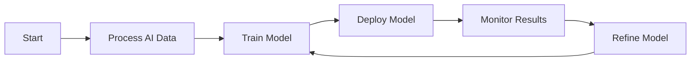
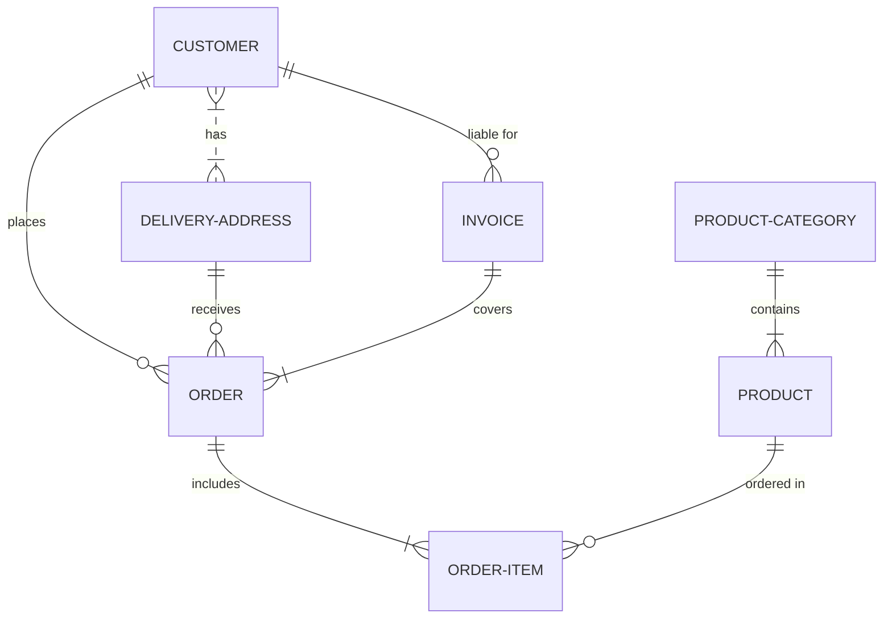
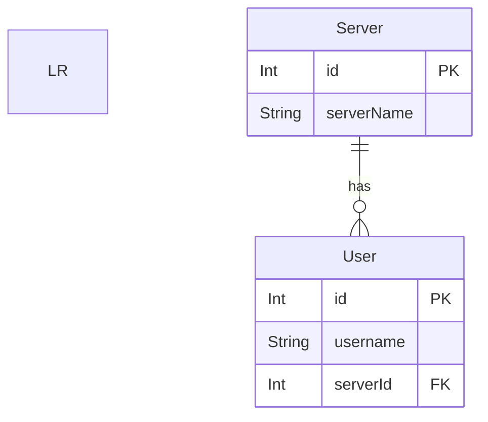

# pbi_content
 My PowerBI Content

### mermaid

### vegalite

%%{init: {
  "theme": "default",
  "themeCSS": [
    ".er.relationshipLabel { fill: black; }", 
    ".er.relationshipLabelBox { fill: white; }", 
    ".er.entityBox { fill: lightgray; }",
    "[id^=entity-some] .er.entityBox { fill: lightgreen;} ",
    "[id^=entity-mytable] .er.entityBox { fill: powderblue;} ",
    "[id^=entity-anothertable] .er.entityBox { fill: pink;} "
    ]
}}%%
