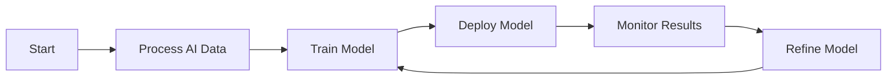
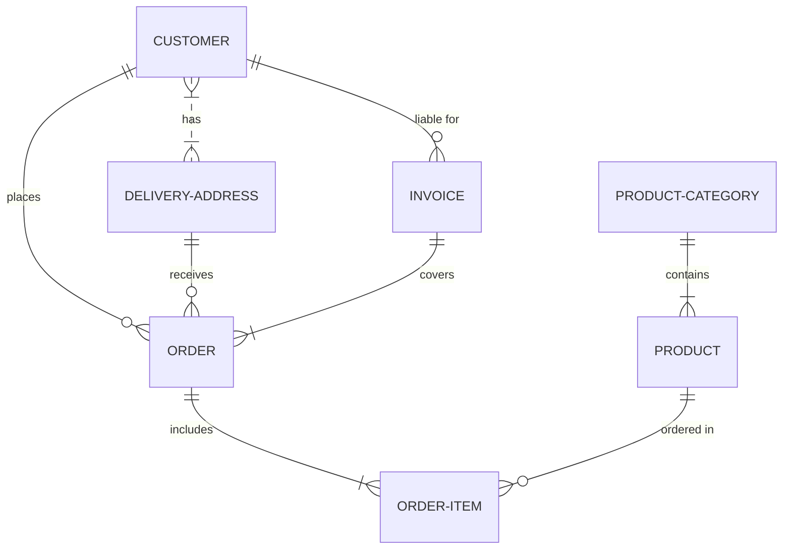
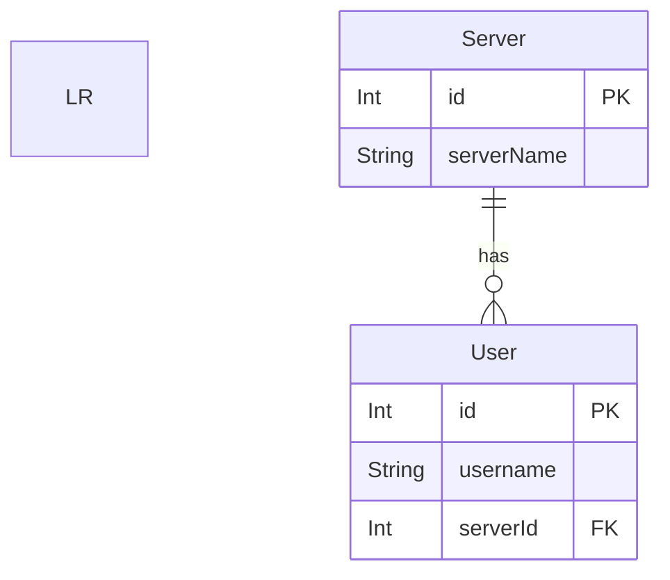
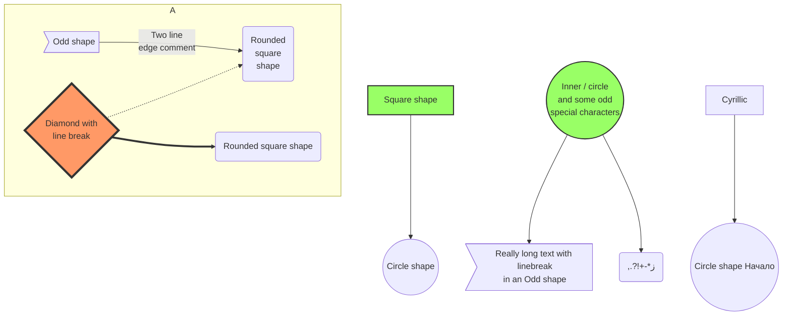
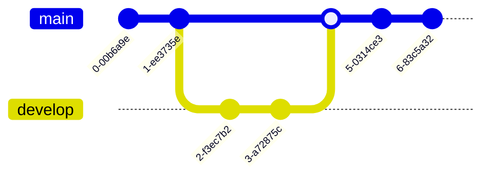
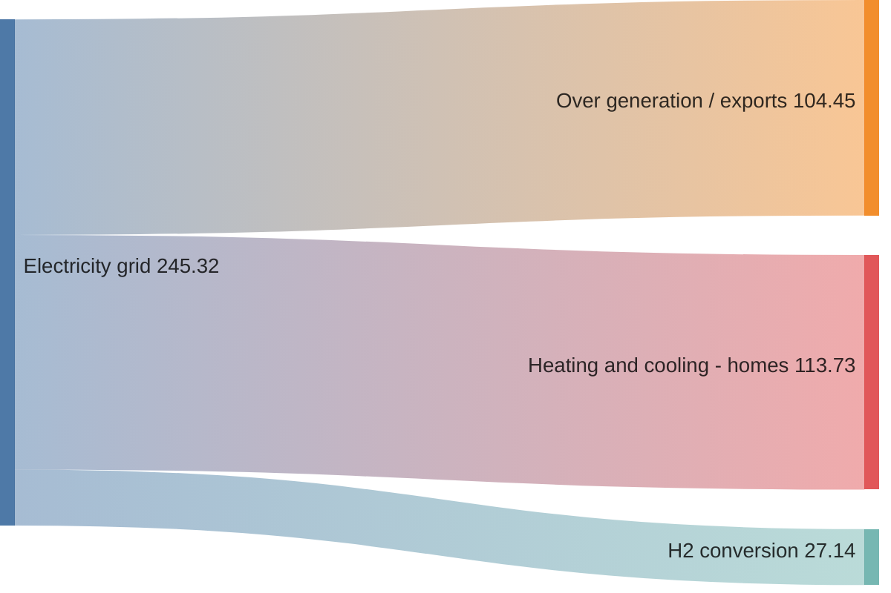
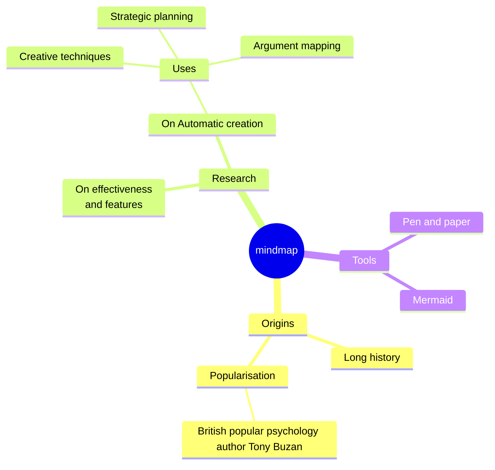
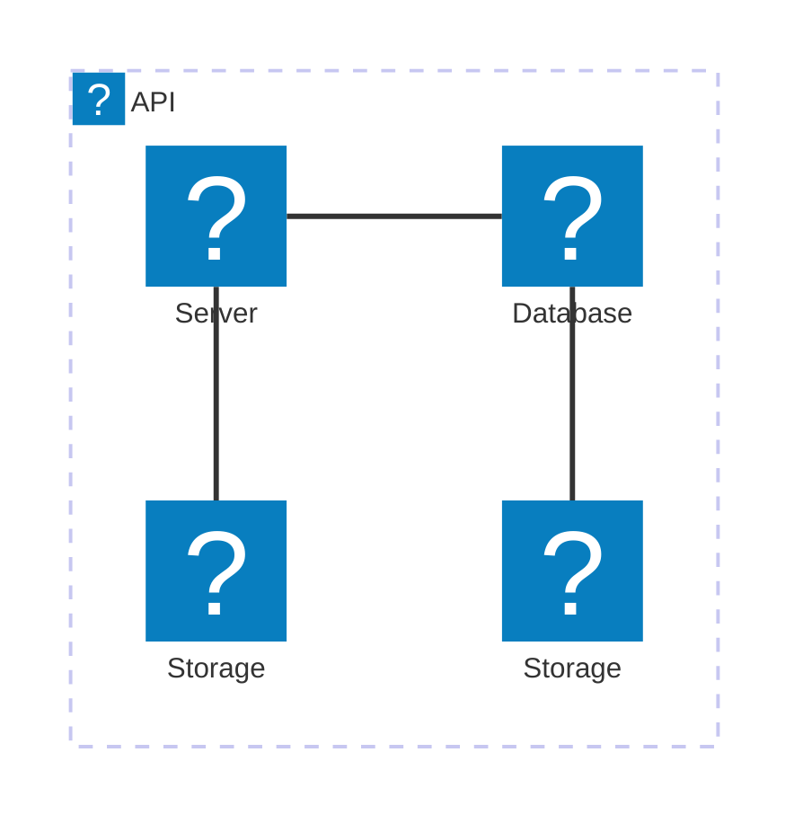

# pbi_content
 My PowerBI Content

### mermaid

```mermaid
graph LR
    A[Start] --> B[Process AI Data]
    B --> C[Train Model]
    C --> D[Deploy Model]
    D --> E[Monitor Results]
    E --> F[Refine Model]
    F --> C
```

### vegalite

```mermaid
erDiagram
    CUSTOMER }|..|{ DELIVERY-ADDRESS : has
    CUSTOMER ||--o{ ORDER : places
    CUSTOMER ||--o{ INVOICE : "liable for"
    DELIVERY-ADDRESS ||--o{ ORDER : receives
    INVOICE ||--|{ ORDER : covers
    ORDER ||--|{ ORDER-ITEM : includes
    PRODUCT-CATEGORY ||--|{ PRODUCT : contains
    PRODUCT ||--o{ ORDER-ITEM : "ordered in"
```

```mermaid
erDiagram LR
    User {
        Int id PK
        String username
        Int serverId FK
    }

    Server {
        Int id PK
        String serverName
    }

    Server ||--o{ User : has
```

```mermaid
graph TB
     sq[Square shape] --> ci((Circle shape))
subgraph A
         od>Odd shape]-- Two line<br/>edge comment --> ro
         di{Diamond with <br/> line break} -.-> ro(Rounded<br>square<br>shape)
         di==>ro2(Rounded square shape)
     end
%% Notice that no text in shape are added here instead that is appended further down
     e --> od3>Really long text with linebreak<br>in an Odd shape]
%% Comments after double percent signs
     e((Inner / circle<br>and some odd <br>special characters)) --> f(,.?!+-*ز)
cyr[Cyrillic]-->cyr2((Circle shape Начало));
classDef green fill:#9f6,stroke:#333,stroke-width:2px;
     classDef orange fill:#f96,stroke:#333,stroke-width:4px;
     class sq,e green
     class di orange
```

```mermaid
    gitGraph
      commit
      commit
      branch develop
      checkout develop
      commit
      commit
      checkout main
      merge develop
      commit
      commit
```

```mermaid
sankey-beta

%% source,target,value
Electricity grid,Over generation / exports,104.453
Electricity grid,Heating and cooling - homes,113.726
Electricity grid,H2 conversion,27.14

```

```mermaid
mindmap
  root((mindmap))
    Origins
      Long history
      ::icon(fa fa-book)
      Popularisation
        British popular psychology author Tony Buzan
    Research
      On effectiveness<br/>and features
      On Automatic creation
        Uses
            Creative techniques
            Strategic planning
            Argument mapping
    Tools
      Pen and paper
      Mermaid

```

```mermaid
architecture-beta
    group api(logos:aws-lambda)[API]

    service db(logos:aws-aurora)[Database] in api
    service disk1(logos:aws-glacier)[Storage] in api
    service disk2(logos:aws-s3)[Storage] in api
    service server(logos:aws-ec2)[Server] in api

    db:L -- R:server
    disk1:T -- B:server
    disk2:T -- B:db

```
